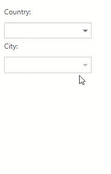

<!-- default badges list -->

[](https://supportcenter.devexpress.com/ticket/details/E2844)
[](https://docs.devexpress.com/GeneralInformation/403183)
<!-- default badges end -->
# MVC ComboBox Extension - Cascading Combo Boxes
<!-- run online -->
**[[Run Online]](https://codecentral.devexpress.com/e2844/)**
<!-- run online end -->

This demo illustrates how to use two [ComboBox](https://docs.devexpress.com/AspNetMvc/8984/components/data-editors-extensions/combobox) editors to implement cascading combo boxes within the MVC ComboBox Extension. In the demo, the selection in the first combo box (Country) filters the item list of the second combo box (City).



Define two combo boxes that make up the cascading combo box. Each combo box is defined in its own partial view file ([CountryPartial.cshtml]() and [CityPartial.cshtml]()). Bind them to their respective models ([Country.cs](./CS/DevExpressMvc3CascadingCombo/Models/Country.cs) and [City.cs](./CS/DevExpressMvc3CascadingCombo/Models/City.cs)) with the [BindList](https://docs.devexpress.com/AspNetMvc/DevExpress.Web.Mvc.ComboBoxExtension.BindList(System.Object)) method. Set [CallbackRouteValues](https://docs.devexpress.com/AspNetMvc/DevExpress.Web.Mvc.AutoCompleteBoxBaseSettings.CallbackRouteValues) in the combo boxes' settings to tie them to the server-side methods:
```c#
// CountryPartial.cshtml
@Html.DevExpress().ComboBox(settings => {
    settings.Name = "Country";
    ...
    settings.CallbackRouteValues = new { Controller = "Home", Action = "CountryPartial" };
    ...
}).BindList(CS.Models.Country.GetCountries()).Bind(Model.Country).GetHtml()  

// CityPartial.cshtml
@Html.DevExpress().ComboBox(settings => {
    settings.Name = "City";
    ...
    settings.CallbackRouteValues = new { Controller = "Home", Action = "CityPartial" };
    ...
}).BindList(CS.Models.City.GetCities(Model.Country)).Bind(Model.City).GetHtml()
``` 

In the first combo box's client-side [SelectedIndexChanged](https://docs.devexpress.com/AspNet/DevExpress.Web.ComboBoxClientSideEvents.SelectedIndexChanged) event handler, call the client-side [PerformCallback](https://docs.devexpress.com/AspNetMvc/js-MVCxClientComboBox.BeginCallback) method to send a callback for the second combo box to the server.
```c#
// Country combo box initialization.
    ...
    settings.Properties.ClientSideEvents.SelectedIndexChanged = "function(s, e) { City.PerformCallback(); }";
    ...
```

In the second combo box's client-side [BeginCallback](https://docs.devexpress.com/AspNet/DevExpress.Web.AutoCompleteBoxClientSideEvents.BeginCallback) event handler, pass the value of the first combo box in the event parameter's customArgs property. See the [Passing Values to Controller Action Through Callbacks](https://docs.devexpress.com/AspNetMvc/9941/common-features/callback-based-functionality/passing-values-to-a-controller-action-through-callbacks) topic for details.
```c#
// City combo box initialization.
    ...
    settings.Properties.ClientSideEvents.BeginCallback = "function(s, e) { e.customArgs['Country'] = Country.GetValue(); }";
    ...
```

On the server side, handle the method defined in the second combo box's CallbackRouteValues.Action parameter. In this method, use the event parameter's value as a filter to populate the second combo box's.
```c#
public ActionResult CityPartial() {
    int country = (Request.Params["Country"] != null) ? int.Parse(Request.Params["Country"]) : -1;
    return PartialView(new Customer { Country = country });
}
```

## Files to Look At
* [HomeController.cs](./CS/DevExpressMvc3CascadingCombo/Controllers/HomeController.cs)
* [Customer.cs](./CS/DevExpressMvc3CascadingCombo/Models/Customer.cs)
* [CityPartial.cshtml](./CS/DevExpressMvc3CascadingCombo/Views/Home/CityPartial.cshtml)
* [CountryPartial.cshtml](./CS/DevExpressMvc3CascadingCombo/Views/Home/CountryPartial.cshtml)
* [Index.cshtml](./CS/DevExpressMvc3CascadingCombo/Views/Home/Index.cshtml)
* [Success.cshtml](./CS/DevExpressMvc3CascadingCombo/Views/Home/Success.cshtml)
## Documentation

## More Examples
[Cascading Combo Boxes in ASP.NET Web Forms](https://github.com/DevExpress-Examples/asp-net-web-forms-cascading-comboboxes)