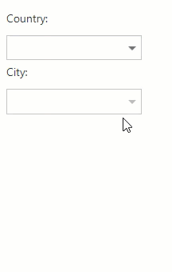

<!-- default badges list -->

[](https://supportcenter.devexpress.com/ticket/details/E2844)
[](https://docs.devexpress.com/GeneralInformation/403183)
<!-- default badges end -->
# MVC ComboBox Extension - Cascading Combo Boxes
<!-- run online -->
**[[Run Online]](https://codecentral.devexpress.com/e2844/)**
<!-- run online end -->

This demo illustrates how to use two [ComboBox](https://docs.devexpress.com/AspNetMvc/8984/components/data-editors-extensions/combobox) editors to implement cascading combo boxes within the MVC ComboBox Extension. In the demo, the selection in the first combo box (Country) filters the item list of the second combo box (City).



## Models
Create three models---for a country ([Country.cs]()), a city ([City.cs]()) and a customer ([Customer.cs]()).

Create methods for the Country model and the City model that generate test data for the example.
```c#
//Country.cs
public static IEnumerable<Country> GetCountries(){
    List<Country> list = new List<Country>();
    for (int i = 0; i < 100; i++)
        list.Add(new Country { ID = i, Name = "Country " + i.ToString() });
    return list;
}
```
```c#
//City.cs
public static IEnumerable<City> GetCities(int country){
    List<City> list = new List<City>();
    for (int i = 0; i < 10000; i++)
        if (country >= 0 && i % 100 == country)
            list.Add(new City { ID = i, Name = "City " + i.ToString(), CountryID = i % 100 });
    return list;
}
```
## View
Define two combo boxes that make up the cascading combo box. Each combo box is defined in its own partial view file ([CountryPartial.cshtml]() and [CityPartial.cshtml]()). Bind them to their respective models ([Country.cs](./CS/DevExpressMvc3CascadingCombo/Models/Country.cs) and [City.cs](./CS/DevExpressMvc3CascadingCombo/Models/City.cs)) with the [BindList](https://docs.devexpress.com/AspNetMvc/DevExpress.Web.Mvc.ComboBoxExtension.BindList(System.Object)) method. Set [CallbackRouteValues](https://docs.devexpress.com/AspNetMvc/DevExpress.Web.Mvc.AutoCompleteBoxBaseSettings.CallbackRouteValues) in the combo boxes' settings to tie them to the server-side methods.
### Country Combo Box 
Handle client-side [SelectedIndexChanged](https://docs.devexpress.com/AspNet/DevExpress.Web.ComboBoxClientSideEvents.SelectedIndexChanged) event. In the event handler, call the second combo box's client-side [PerformCallback](https://docs.devexpress.com/AspNetMvc/js-MVCxClientComboBox.BeginCallback) method to generate a callback to the server.

```c#
// CountryPartial.cshtml
@Html.DevExpress().ComboBox(settings => {
    settings.Name = "Country";
    ...
    settings.CallbackRouteValues = new { Controller = "Home", Action = "CountryPartial" };
    ...
    settings.Properties.ClientSideEvents.SelectedIndexChanged = "function(s, e) { City.PerformCallback(); }";
}).BindList(CS.Models.Country.GetCountries()).Bind(Model.Country).GetHtml()  
```

### City Combo Box
Handle the client-side [BeginCallback](https://docs.devexpress.com/AspNet/DevExpress.Web.AutoCompleteBoxClientSideEvents.BeginCallback) event. In the event handler, send the first combo box's value to the server side in the custom callback parameter. Use this value to filter the selection in the second combo box on the server side.
```c#
// CityPartial.cshtml
@Html.DevExpress().ComboBox(settings => {
    settings.Name = "City";
    ...
    settings.CallbackRouteValues = new { Controller = "Home", Action = "CityPartial" };
    ...
    settings.Properties.ClientSideEvents.BeginCallback = "function(s, e) { e.customArgs['Country'] = Country.GetValue(); }";
}).BindList(CS.Models.City.GetCities(Model.Country)).Bind(Model.City).GetHtml()
```

Add created combo boxes to the Index page:

```c# 
@using(Html.BeginForm()) {  
    @Html.Partial("CountryPartial", Model)
    @Html.Partial("CityPartial", Model)
    ...
```
## Controller: Filter Data Source Items
In the controller, filter the items and return the updated view. Return a new City combo box partial view and initialize the Country parameter with the country index passed to the server in the custom callback parameter.

```c#
public ActionResult CityPartial() {
    int country = (Request.Params["Country"] != null) ? int.Parse(Request.Params["Country"]) : -1;
    return PartialView(new Customer { Country = country });
}
```

## Files to Look At
* [HomeController.cs](./CS/DevExpressMvc3CascadingCombo/Controllers/HomeController.cs)
* [Customer.cs](./CS/DevExpressMvc3CascadingCombo/Models/Customer.cs)
* [CityPartial.cshtml](./CS/DevExpressMvc3CascadingCombo/Views/Home/CityPartial.cshtml)
* [CountryPartial.cshtml](./CS/DevExpressMvc3CascadingCombo/Views/Home/CountryPartial.cshtml)
* [Index.cshtml](./CS/DevExpressMvc3CascadingCombo/Views/Home/Index.cshtml)
* [Success.cshtml](./CS/DevExpressMvc3CascadingCombo/Views/Home/Success.cshtml)
## Documentation

## More Examples
[Cascading Combo Boxes in ASP.NET Web Forms](https://github.com/DevExpress-Examples/asp-net-web-forms-cascading-comboboxes)